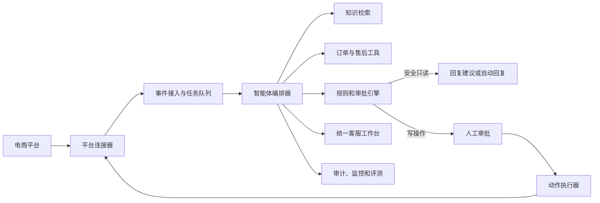

# Commerce Copilot 设计规格

> 日期：2026-07-11
> 状态：已完成方案讨论，等待用户审阅书面规格
> 产品范围：单公司、多店铺、多电商平台客服中台
> 首发平台：抖音电商

## 1. 目标与判断

Commerce Copilot 是一个由公司内部部署和使用的多平台智能客服中台。它统一管理客服会话、商品知识、订单上下文、售后建议、人工审批、模型配置和审计记录。第一阶段以抖音电商为正式适配平台，后续按同一连接器协议扩展淘宝/天猫、京东、拼多多、小红书和快手。

本项目解决的核心问题不是“让大模型聊天”，而是让客服在可验证、可审批、可追责的前提下更快完成售前、售中和售后工作。所有设计围绕以下原则展开：

1. 客户购买或使用的是正确、及时的客服结果，不是模型能力本身。
2. 商品、订单、物流和售后状态必须来自结构化平台接口，不允许模型猜测。
3. 涉及资金或订单状态的写操作必须经过规则引擎和人工审批。
4. 平台未开放的能力不得通过抓包、页面 DOM、模拟点击或索要店铺密码绕过。
5. 每个平台明确声明自身能力，系统只启用已获得权限并通过真实验证的功能。

## 2. 已确认约束

- 使用主体是一个公司，不建设面向外部商家的 SaaS。
- 公司可能拥有同一平台的多个自有店铺。
- 最终目标覆盖抖音、淘宝/天猫、京东、拼多多、小红书和快手。
- 首个正式接入和验收的平台是抖音电商。
- 首版查询类操作可以自动执行。
- 退款、退货审批、改价、取消订单、补发和改址等写操作必须由人工确认。
- 系统需要良好的中文 UI、完整内部 API、部署说明、模拟环境和自动化测试。
- 未提供平台授权或模型密钥时，系统仍需通过模拟连接器完整演示和验收。
- 获得相应平台应用资质后，管理员只需录入配置并完成 OAuth 授权，不应修改业务代码。

## 3. 平台事实与能力边界

抖店开放平台允许自用型应用通过 OAuth2.0 获取自有店铺授权，并在具备对应权限时读取商品、订单、物流和售后数据，也提供部分售后处理接口及事件订阅。

截至本规格编写时，抖店开放平台公开文档明确说明，普通应用没有面向消费者的飞鸽客服消息收发 API；历史文档同样说明飞鸽会话消息接口未向普通应用开放。平台在 2025 年开放过“商家 AI 智能客服微应用”招募，但属于经过资质、案例、评测和平台审核的受控能力。

因此，抖音连接器必须采用能力探测和降级设计：

- 已获得官方 AI 智能客服微应用权限：启用合规消息接收和发送适配器。
- 只有普通自用型应用权限：启用商品、订单、物流、售后和事件能力；消息回复在飞鸽辅助工作台由人工确认并发送。
- 平台权限不足或接口审核未通过：显示明确的“等待资质”状态，不尝试规避限制。

相关官方依据：

- [飞鸽客服收发消息 API 说明](https://op.jinritemai.com/docs/question-docs/96/7466)
- [商家 AI 智能客服微应用招募](https://op.jinritemai.com/docs/notice-docs/22/7628)
- [抖店售后场景接入指南](https://op.jinritemai.com/docs/guide-docs/199/625)
- [抖店店铺授权说明](https://op.jinritemai.com/docs/question-docs/116/183)

## 4. 方案比较与选型

### 4.1 采用：模块化单体加平台连接器

管理后台、API、智能体编排、审批引擎和任务处理运行在同一个代码仓库内，通过清晰模块边界协作。PostgreSQL、Redis 和对象存储作为独立基础服务部署。每个平台使用独立连接器包实现统一合同。

选择原因：单公司场景的首要目标是快速部署、低维护成本和一致体验。模块化单体可以保留清晰边界和后续拆分能力，同时避免微服务带来的服务发现、分布式事务、链路追踪和多套部署配置。

对用户的影响：管理员只维护一套系统；客服在一个界面完成查询、建议和审批；增加平台时不会改变客服操作方式。

### 4.2 不采用：从第一天建设微服务

微服务适合多个独立团队、极高吞吐或需要独立扩缩容的 SaaS。当前采用它会显著增加部署、排错和本地开发成本，没有对应用户收益。

### 4.3 不采用：把第三方 AI 客服作为系统核心

第三方已入驻平台的客服服务可以作为合规消息桥接器，但不能成为商品知识、审批规则和审计数据的唯一来源。核心业务数据保留在 Commerce Copilot，避免后续替换供应商时丢失规则和历史。

## 5. 系统架构

### 5.1 应用组成

- `apps/web`：中文管理后台和客服工作台。
- `apps/api`：REST API、OAuth 回调、平台 Webhook、SSE 实时事件和 OpenAPI 文档。
- `apps/worker`：数据同步、知识处理、模型任务、重试和死信任务。
- `packages/domain`：会话、审批、动作、规则和平台能力等领域模型。
- `packages/agent`：意图识别、上下文组装、工具调用、回复生成和安全门控。
- `packages/connectors`：统一连接器合同、模拟连接器及各平台实现。
- `packages/ui`：可复用设计系统和业务组件。
- `packages/config`：环境变量、运行时配置和安全校验。
- `packages/testing`：平台夹具、连接器合同测试和 AI 评测工具。

### 5.2 技术栈

- 前端：Next.js、React、TypeScript、Tailwind CSS。
- API：NestJS、TypeScript、OpenAPI 3.1。
- 数据库：PostgreSQL，使用 pgvector 存储知识向量。
- 队列与缓存：Redis、BullMQ。
- 文件存储：S3 兼容接口，本地部署默认使用 MinIO。
- 实时更新：Server-Sent Events；平台事件通过 Webhook 和队列进入系统。
- 模型网关：支持 OpenAI 兼容协议，并为需要特殊鉴权的提供商保留适配器。
- 部署：Docker Compose；所有服务带健康检查和持久化卷。

## 6. 平台连接器合同

每个连接器必须返回能力清单，系统不得根据平台名称猜测能力。标准能力包括：

- `store.authorize`
- `store.token.refresh`
- `catalog.product.read`
- `order.read`
- `logistics.read`
- `afterSale.read`
- `afterSale.write`
- `message.receive`
- `message.send`
- `event.subscribe`
- `event.verify`

连接器必须实现以下边界：

1. OAuth 授权 URL 生成、回调校验、Token 加密保存和刷新。
2. 平台原始对象到统一商品、订单、售后和消息模型的转换。
3. 请求签名、Webhook 验签、限流、重试和错误归一化。
4. 幂等键生成，保证重复事件不会造成重复写操作。
5. 健康检查和能力状态，供接入页面展示。
6. 沙箱或模拟实现，确保无真实授权时也能开发和验收。

抖音连接器首版正式覆盖 OAuth、多店铺授权、商品读取、订单读取、物流读取、售后读取、售后事件和经审批的售后操作。飞鸽消息能力由官方资质决定，不能获得权限时使用辅助工作台模式。

其他平台在第一阶段提供连接器包边界、配置模型、能力矩阵和模拟夹具。其真实接口仅在官方文档核验、应用权限获得、沙箱测试通过和真实店铺验收后标记为生产可用。

## 7. 智能体执行流程

每次咨询按以下顺序处理：

1. 接收并标准化平台事件或人工录入的会话上下文。
2. 识别店铺、客户身份、关联商品和可能的订单。
3. 使用结构化输出识别意图，但不允许意图模型直接执行动作。
4. 查询实时商品、订单、物流或售后工具。
5. 从已发布的知识库版本检索售前、售后和品牌政策，并保留引用来源。
6. 规则引擎检查动作白名单、订单状态、金额、时限、重复索赔和风险信号。
7. 生成带依据的回复建议；证据不足时生成转人工原因，不生成猜测答案。
8. 只读且满足自动回复规则的场景可以发送；其余场景进入客服确认。
9. 写操作生成不可变的动作提案，等待对应级别审批。
10. 执行前重新查询订单状态，审批仍有效时才调用平台接口。
11. 保存输入、证据、模型输出、规则结果、审批和执行结果。

模型不得使用自报“置信度”作为唯一门槛。自动化门槛由是否找到有效知识来源、结构化数据是否完整、规则是否匹配及平台能力是否可用共同决定。

## 8. 人工审批设计

### 8.1 默认风险等级

| 等级 | 操作 | 默认处理 |
| --- | --- | --- |
| 只读 | 商品、库存、订单、物流和政策查询 | 可自动执行 |
| 低风险写入 | 小额补偿、订单备注 | 客服一键审批 |
| 中风险写入 | 退款、退货、换货、补发和改址 | 客服审批；超阈值转主管 |
| 高风险 | 大额退款、已发货改址、超期售后和规则外赔偿 | 主管审批 |
| 极高风险 | 批量退款、价格规则和权限变更 | 双人或财务审批 |
| 特殊事件 | 法律、媒体、安全、隐私删除和疑似欺诈 | 禁止自动执行，转专人 |

金额阈值由管理员按店铺或商品类目配置。系统提供示例规则，但不把示例金额作为生产默认值。所有写操作默认关闭，管理员必须显式启用并配置审批人。

### 8.2 动作安全

- 每个动作提案包含目标订单、动作类型、金额、依据、过期时间和唯一幂等键。
- 审批页面展示消费者原话、订单状态、引用规则和预期影响。
- 审批通过不等于必然执行；执行器会再次读取实时状态并重新校验。
- 平台调用失败不会自动改用其他动作，系统进入可重试或人工处理状态。
- 审批撤销、超时、重复点击和并发审批均有确定结果。

## 9. 知识与数据设计

### 9.1 数据来源

- 平台商品标题、SKU、规格、价格和库存快照。
- 公司维护的 FAQ、品牌话术、活动说明和禁用表达。
- 退换货、保修、物流、发票、价保和赔付政策。
- 已脱敏且获得内部授权的优秀历史会话。

### 9.2 知识发布

- 原始资料先进入草稿区，完成解析和分段后才能发布。
- 发布生成不可变版本；会话记录引用具体知识版本和段落。
- 更新政策不会修改历史审计依据。
- 过期文档自动停止参与检索，但不删除历史引用。
- 结构化订单和商品数据优先于向量检索结果。

## 10. 核心数据模型

- `Company`：公司级配置。
- `User`、`Role`、`Permission`：管理员、主管、客服和审计员权限。
- `Store`、`PlatformIntegration`、`SecretCredential`：店铺、连接器及加密凭据。
- `CapabilityState`：每个店铺当前可用的平台能力。
- `CustomerIdentity`：平台内消费者标识，不跨平台擅自合并身份。
- `Conversation`、`Message`：统一会话和消息记录。
- `ProductSnapshot`、`OrderSnapshot`、`AfterSaleCase`：平台结构化数据缓存。
- `KnowledgeSource`、`KnowledgeDocument`、`KnowledgeChunk`、`KnowledgeRelease`：知识资料和发布版本。
- `PolicyRule`：自动回复、审批、额度和转人工规则。
- `ActionProposal`、`ApprovalDecision`、`ExecutionAttempt`：动作生命周期。
- `AuditEvent`：不可变审计事件。
- `EvaluationCase`、`EvaluationRun`：AI 回归数据和评测结果。
- `BackgroundJob`：同步、索引、重试和死信任务状态。

所有业务表保留 `company_id`，虽然首版只有一个公司，也避免未来数据边界模糊。

## 11. 内部 API

所有 API 使用 `/api/v1` 前缀，返回统一错误结构并生成 OpenAPI 文档。

- `/auth/*`：登录、刷新、登出和当前会话。
- `/users`、`/roles`：用户和权限。
- `/integrations`：平台配置、能力和健康检查。
- `/integrations/{platform}/oauth/*`：授权发起和回调。
- `/webhooks/{platform}`：平台事件入口。
- `/stores`：店铺和同步状态。
- `/conversations`、`/messages`、`/handoffs`：会话、消息和转人工。
- `/products`、`/orders`、`/logistics`、`/after-sales`：统一业务查询。
- `/knowledge/sources`、`/knowledge/documents`、`/knowledge/releases`、`/knowledge/search`：知识管理。
- `/agent/suggest`、`/agent/explain`：回复建议及依据解释。
- `/actions`、`/approvals`：动作提案、审批和执行状态。
- `/rules`：自动化和审批规则。
- `/model-providers`：模型提供商及连通性测试。
- `/evaluations`：评测集、运行和对比。
- `/audit-events`：审计查询和导出。
- `/metrics`、`/health`、`/ready`：业务指标和运行状态。
- `/events/stream`：工作台实时更新。

## 12. UI 与交互设计

### 12.1 视觉原则

- 默认中文、桌面优先，同时保证常用审批页面在窄屏可用。
- 采用中性背景、清晰层级和少量状态色，避免把运营后台设计成营销落地页。
- 支持浅色与深色主题，保证文字和状态对比度。
- 所有异步操作展示进行中、成功、可重试或需要人工处理的明确反馈。
- 高风险按钮展示动作影响，不使用模糊的“确定”按钮。

### 12.2 页面

1. **首次配置向导**：创建管理员、配置模型、连接店铺、同步数据、导入知识、运行验收对话。
2. **数据总览**：咨询量、首次响应时间、解决率、转人工率、审批等待和接口健康。
3. **统一会话台**：三栏布局；左侧会话列表，中间消息，右侧客户、商品、订单、证据和动作卡片。
4. **审批中心**：待办、已批准、已拒绝、已过期和执行失败；支持按风险和店铺过滤。
5. **知识库**：资料导入、解析状态、版本差异、发布和回滚。
6. **平台接入**：平台卡片、店铺授权、能力矩阵、Token 健康、Webhook 状态和同步日志。
7. **规则中心**：自动回复范围、转人工条件、额度、审批链和营业时间。
8. **模型配置**：提供商、模型、密钥、超时、预算、备用模型和连通性测试。
9. **评测中心**：评测集、版本对比、错误分类、会话回放和发布门禁。
10. **审计日志**：按消费者、订单、客服、动作或时间查询完整时间线。

客服可使用键盘快捷键批准建议、编辑回复、转人工和打开订单。AI 建议必须与人工原始输入清晰区分，引用知识可以一键展开。

## 13. 模型网关

- 管理员通过界面配置提供商、基础地址、API Key、模型名、超时和预算。
- 密钥只允许写入和重新设置，不通过 API 或 UI 回显明文。
- 对话模型和向量模型可以使用不同提供商。
- 支持主模型和备用模型；只有可重试故障才触发切换。
- 所有智能体步骤使用版本化结构化输出 Schema。
- 模型超时、格式错误或内容安全失败时转人工，不直接发送半成品。
- 记录 Token、耗时、模型版本和成本估算，但不在日志中保存密钥或未脱敏敏感字段。

## 14. 异常处理与降级

- **Token 过期**：后台刷新；刷新失败后暂停该店铺写操作并通知管理员重新授权。
- **平台限流**：遵循响应头和平台规则退避，查询任务可延迟，写操作不盲目重试。
- **重复 Webhook**：通过平台事件 ID 和业务幂等键只产生一次业务影响。
- **最终一致性**：付款或售后事件到达后短暂查不到详情时使用有限次数延迟重试。
- **模型不可用**：切换备用模型或转人工；不阻塞订单和售后查询。
- **知识库不可用**：禁止自动回复政策问题，保留结构化订单查询。
- **写操作结果未知**：先查询平台真实状态，再决定是否重试。
- **消息权限不可用**：抖音进入辅助工作台模式，明确提示由人工发送。
- **队列任务耗尽重试**：进入死信队列，并在后台生成可处理告警。

## 15. 安全与合规

- OAuth State、Webhook 签名、CSRF、CORS、速率限制和输入 Schema 必须校验。
- 平台 Token 和模型密钥使用应用主密钥加密后入库。
- 日志默认脱敏手机号、地址、姓名和身份证等个人信息。
- 按角色限制知识发布、规则修改、审批和审计导出。
- 审计事件只追加，不提供普通业务接口修改或删除。
- 数据保留期限可配置；执行删除时同时清理向量、对象文件和缓存。
- 下载和导出使用短时授权链接并记录操作者。
- 不提供店铺账号密码录入功能。

## 16. 测试与发布门禁

### 16.1 自动化测试

- 领域单元测试：审批、额度、状态机、幂等和权限。
- 连接器合同测试：所有平台适配器必须通过同一测试套件。
- API 集成测试：PostgreSQL、Redis、队列、OAuth 状态和 Webhook 验签。
- 前端组件测试：加载、空状态、错误、审批和能力降级。
- Playwright 端到端测试：首次配置、模拟会话、知识发布、审批和审计回放。
- AI 回归评测：正确性、引用、应转人工、禁用话术、动作类型和参数。
- 安全测试：越权、重放、重复 Webhook、密钥泄漏和恶意知识文档。

### 16.2 必须满足的门禁

- 未经审批的写操作执行数量为零。
- 重复事件不会造成重复退款、补发或状态变更。
- 所有自动政策回复都能追溯到已发布知识版本。
- 缺少证据、规则冲突和平台能力不足的测试用例全部转人工。
- 生产构建、类型检查、Lint、单元测试、集成测试和核心 E2E 全部通过。
- 代码、日志、截图和测试夹具不包含真实密钥或未经脱敏的消费者数据。

## 17. 部署与运维

仓库提供 Docker Compose，包含 Web、API、Worker、PostgreSQL、Redis 和 MinIO。部署过程为：

1. 复制示例环境配置并生成应用主密钥。
2. 启动容器并执行数据库迁移。
3. 通过一次性引导链接创建首位管理员。
4. 在 UI 中配置模型并运行连通性测试。
5. 创建抖音平台配置并完成店铺 OAuth。
6. 运行初次商品和订单同步。
7. 导入并发布知识库。
8. 使用模拟会话和真实只读查询完成验收后，再启用自动回复规则。

系统提供结构化日志、健康检查、队列状态、平台请求指标、模型耗时和管理员告警。备份覆盖 PostgreSQL 和对象存储；Redis 仅承载可恢复的队列与缓存状态。

## 18. 交付阶段

1. **基础工程**：仓库、设计系统、认证、数据库、队列、OpenAPI 和 Docker 环境。
2. **可演示闭环**：模拟连接器、知识库、智能体、回复建议、审批、审计和完整 UI。
3. **抖音正式连接器**：OAuth、商品、订单、物流、售后、事件和辅助工作台。
4. **质量加固**：AI 评测、连接器合同测试、E2E、安全和故障降级。
5. **部署交付**：配置向导、运维页面、部署说明、备份恢复和管理员手册。
6. **平台扩展**：按抖音同样的官方文档核验、沙箱、真实授权和验收流程逐个平台启用。

## 19. 验收结果

在没有任何外部授权时，用户可以启动系统、登录、配置模型或模拟模型、导入知识、接收模拟咨询、查看回复依据、审批售后动作并回放审计记录。

完成抖店自用型应用配置和店铺 OAuth 后，系统能够同步授权范围内的商品、订单、物流和售后数据，并在审批后调用已获授权的售后接口。是否能自动接收和发送飞鸽消费者消息，由抖音授予的官方能力决定；没有消息权限时系统保持完整的人工辅助工作台，不伪装为全自动模式。

后续平台达到“只需授权和配置即可使用”的条件是：对应连接器已通过官方文档核验、沙箱或测试店铺、真实授权和连接器合同测试，并在接入页显示为“生产可用”。

## 20. 非目标

- 首版不建设面向外部商家的注册、订阅、计费和租户自助服务。
- 不训练自有基础大模型。
- 不通过非官方方式控制平台客服客户端。
- 不在首版自动批准任何资金或订单状态写操作。
- 不承诺在未获得平台资质时自动接管飞鸽会话。
- 不为了未来假设提前拆分微服务或引入 Kubernetes。
